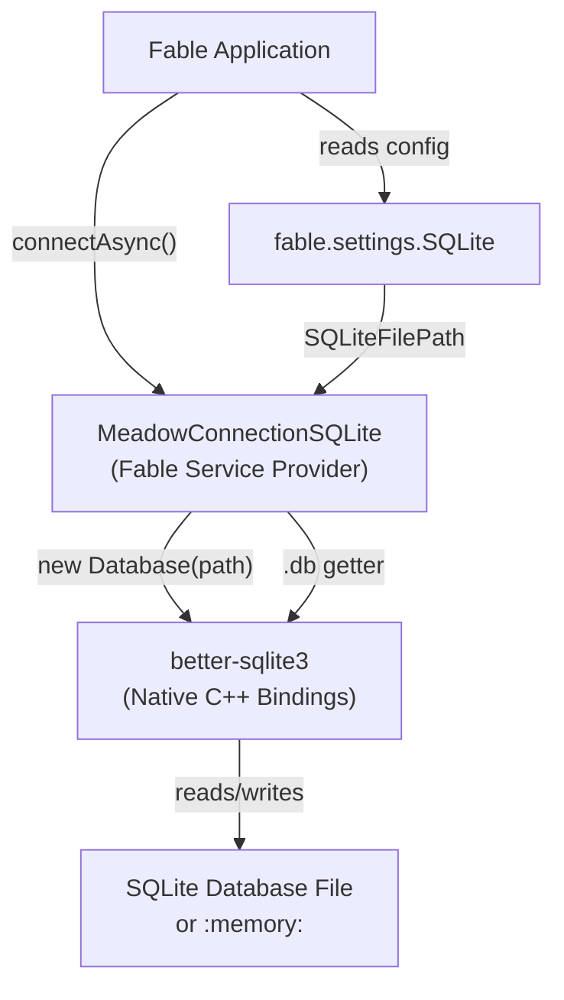
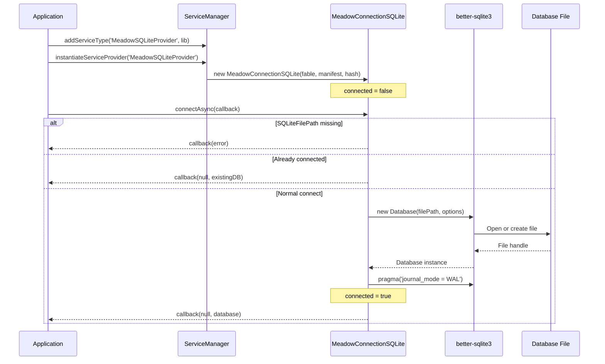
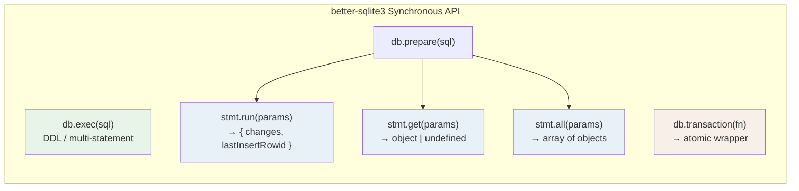
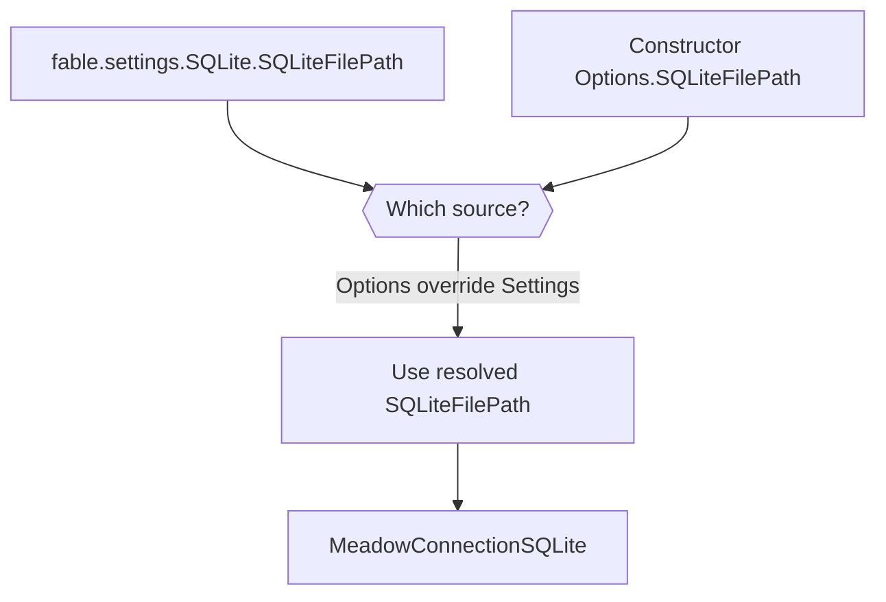
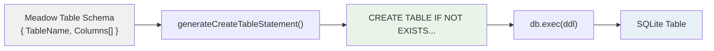
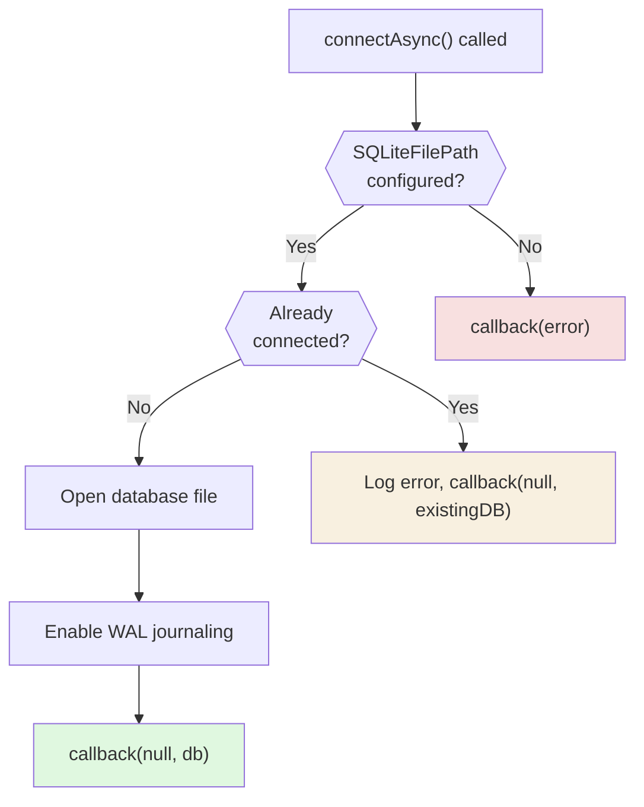
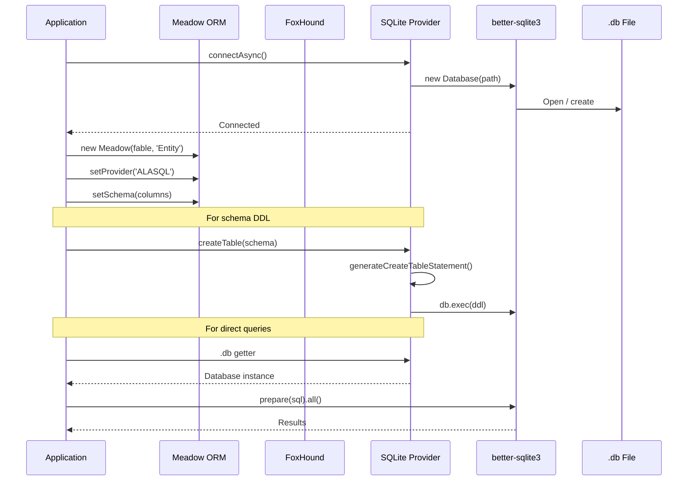

# Architecture & Design

Meadow Connection SQLite connects Fable applications to SQLite databases through the service provider pattern. This page illustrates the system architecture, connection lifecycle, query model, and how the provider fits into the Meadow ecosystem.

---

## System Architecture

---

## Connection Lifecycle

---

## Synchronous Query Model

Unlike MySQL and MSSQL providers which use asynchronous APIs, the SQLite provider uses better-sqlite3's synchronous API. Every query blocks the event loop for the duration of the operation, but better-sqlite3's native C++ bindings make individual operations extremely fast.

### Query Method Selection

| Goal | Method | Returns |
|------|--------|---------|
| Create tables, run DDL | `db.exec(sql)` | nothing |
| INSERT / UPDATE / DELETE | `db.prepare(sql).run(...)` | `{ changes, lastInsertRowid }` |
| SELECT one row | `db.prepare(sql).get(...)` | object or `undefined` |
| SELECT multiple rows | `db.prepare(sql).all(...)` | array of objects |
| Atomic batch operations | `db.transaction(fn)(args)` | return value of `fn` |

---

## Connection Settings Flow

Settings priority:

1. **Constructor options** — passed as the second argument to `instantiateServiceProvider()`
2. **Fable settings** — `fable.settings.SQLite.SQLiteFilePath`

Constructor options take priority, allowing multiple provider instances with different database files.

---

## DDL Generation Flow

Each Meadow column type maps to a SQLite storage class:

| Meadow DataType | SQLite Column Definition |
|-----------------|--------------------------|
| `ID` | `INTEGER PRIMARY KEY AUTOINCREMENT` |
| `GUID` | `TEXT DEFAULT '00000000-0000-0000-0000-000000000000'` |
| `ForeignKey` | `INTEGER NOT NULL DEFAULT 0` |
| `Numeric` | `INTEGER NOT NULL DEFAULT 0` |
| `Decimal` | `REAL` |
| `String` | `TEXT NOT NULL DEFAULT ''` |
| `Text` | `TEXT` |
| `DateTime` | `TEXT` |
| `Boolean` | `INTEGER NOT NULL DEFAULT 0` |

See [Schema & Table Creation](schema.md) for full details.

---

## Connection Safety

The provider guards against:

- **Missing file path** -- Returns an error immediately if `SQLiteFilePath` is not configured
- **Double connect** -- Logs an error and returns the existing database if already connected
- **File creation** -- The database file is created automatically by better-sqlite3 if it does not exist

---

## Meadow Ecosystem Integration

The SQLite connection provider serves two roles in the Meadow ecosystem:

1. **Schema DDL** -- Generates and executes `CREATE TABLE` statements from Meadow table schemas
2. **Direct query access** -- Exposes the `better-sqlite3` database for synchronous query execution

---

## Connector Comparison

| Feature | SQLite | MySQL | MSSQL | RocksDB |
|---------|--------|-------|-------|---------|
| **Server Required** | No | Yes | Yes | No |
| **Query API** | Synchronous | Async (callback) | Async (Promise) | Async (callback) |
| **File-based** | Yes | No | No | Yes |
| **In-memory mode** | `:memory:` | No | No | No |
| **WAL journaling** | Auto-enabled | N/A | N/A | Built-in |
| **Native driver** | better-sqlite3 | mysql2 | mssql (Tedious) | @nxtedition/rocksdb |
| **Connection pooling** | No (single file) | Yes | Yes | No (single handle) |
| **DDL generation** | Yes | Yes | Yes | No |
| **Prepared statements** | `db.prepare()` | Via pool | `ps.prepare()` | N/A |
| **Transactions** | `db.transaction(fn)` | Via pool | Via pool | Batch writes |
| **SQL support** | Full SQLite SQL | Full MySQL SQL | Full T-SQL | Key-value only |
| **Best for** | Local, embedded, test | Production servers | Enterprise | High-throughput KV |
